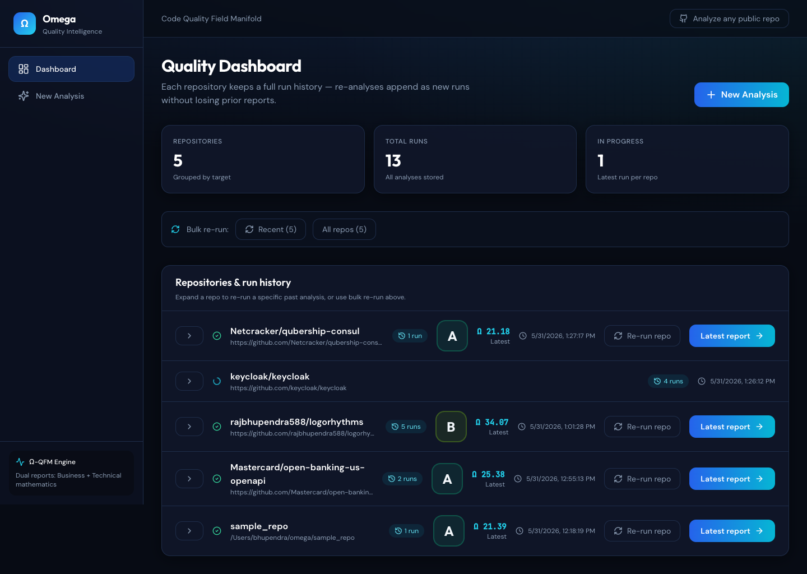
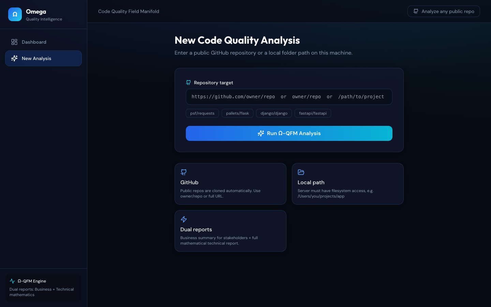
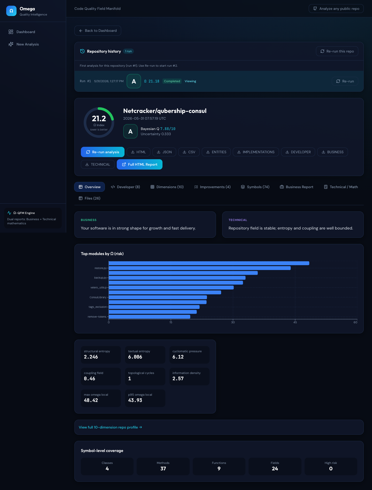
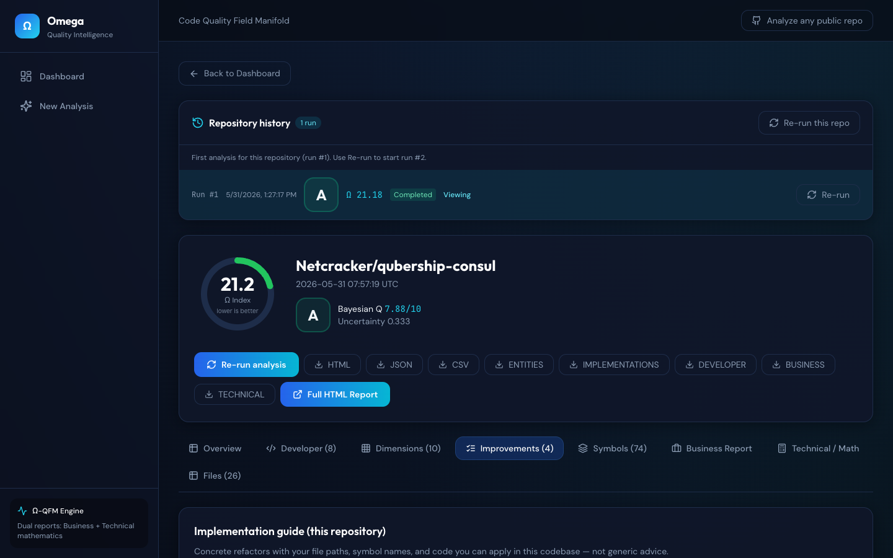

# Omega (Ω-QFM)

Analyze **any GitHub repository** or local project. Get a **detailed dual report**:

1. **Business report** — plain language for leaders, PMs, and non-technical stakeholders  
2. **Technical report** — formulas, methodology, and per-module mathematical metrics  

## Screenshots

**Dashboard** — track repositories, grades, and run history:



**New analysis** — analyze any public GitHub repo or local path:



**Report overview** — Ω index, business/technical summaries, and field metrics:



**Improvements** — copy-paste refactors tied to your files and symbols:



## Architecture: master + language workers

Omega uses a **master agent** that owns repository metadata (inventory, tech stack, coupling) and **spawns one worker agent per language** detected in the repo:

| Worker strategy | Languages | Capabilities |
|-----------------|-----------|--------------|
| `ast_full` | Python, Java, Go | File metrics, AST entities, full implementation plans (Java/Go via tree-sitter) |
| `heuristic_symbols` | JS, TS, Kotlin, Rust, … | File metrics, symbol-level improvements + sketches |
| `file_metrics_only` | SQL, shell, … | File metrics + business notes |

Worker results and the orchestration plan are stored in each report as `agent_manifest` (JSON). Set `OMEGA_MAX_WORKER_AGENTS=8` to cap parallel workers.

### Performance (large repos like [google/guava](https://github.com/google/guava))

| Variable | Default | Effect |
|----------|---------|--------|
| `OMEGA_MAX_FILES` | `350` | Cap production source files analyzed (largest files kept) |
| `OMEGA_SKIP_TEST_PATHS` | `1` | Skip `guava-tests`, `*-tests`, `__tests__`, etc. |
| `OMEGA_FILE_WORKERS` | `8` | Parallel per-file analysis within each language worker |
| `OMEGA_IMPL_MAX_ENTITIES` | `80` | Implementation diffs only for top-N riskiest symbols |
| `OMEGA_MAX_ENTITIES_PER_FILE` | `10` | Cap symbols extracted per file (heuristic) |

Use `OMEGA_MAX_FILES=0` for no file cap (slow on huge monorepos).

## Quick start

```bash
cd /Users/bhupendra/omega
pip install -e .

# Local folder
omega sample_repo

# Any public GitHub repo
omega https://github.com/psf/requests
omega psf/requests

# Save reports
omega psf/requests --out ./my-reports
```

## Open the final outcome

| File | Audience |
|------|----------|
| **`omega-report.html`** | Everyone — tabs: Overview, **Business**, **Technical**, All Files |
| `omega-report-business.md` | Executives, product, business |
| `omega-report-technical.md` | Engineers, architects, researchers |
| `omega-files.csv` | Spreadsheets, BI tools |
| `omega-report.json` | CI/CD, custom dashboards |

## Options

```bash
omega owner/repo --cache-dir ~/.omega/repos   # reuse clones
omega . --out reports
```

Scans include **all** discoverable source files in the repository (no file-count cap).

## Supported languages

Python, **Java**, and **Go** use **full AST** analysis (cyclomatic complexity, nesting, structural entropy, import coupling). JavaScript, TypeScript, Kotlin, C#, Rust, Ruby, PHP, Scala, C/C++, and more get **heuristic** file metrics and symbol-level improvements with implementation sketches where complexity thresholds are met.

## Web dashboard (world-class UI)

Run analysis and view **Business + Technical** reports in the browser.

```bash
chmod +x scripts/start-ui.sh
./scripts/start-ui.sh
```

Open **http://127.0.0.1:5173** (development — UI and API auto-reload on file changes).

Production-style (single port, built assets):

```bash
./scripts/start-ui.sh --prod
# Open http://127.0.0.1:8765
```

- **Dashboard** — history of all analyses  
- **New Analysis** — paste any public `owner/repo` or GitHub URL  
- **Report view** — Overview, **Developer**, **Dimensions**, **Improvements**, **Symbols**, Business, Technical, Files, exports
- **Granular analysis** — every class, method, and field measured with specific improvement areas  
- **Metric suite** — N mathematical metrics (code field, business context, upstream/downstream services, ecosystem impact); optional `.omega/ecosystem.yaml` for service graph  
- **Dimension families** — contextual lenses (`field`, `business`, and optional `ecosystem`, `ai_era`, `ml_dl`, `temporal` when the repo qualifies). **Letter grade A–F uses the Ω index only** — dimension scores do not change the grade  

Manual split (optional):

```bash
OMEGA_RELOAD=1 omega-ui          # API only, port 8765
cd dashboard && npm run dev      # UI only, port 5173
```

## Requirements

- Python 3.10+
- `git` on PATH (for GitHub URLs)
- Node.js 18+ (to build dashboard, or use `scripts/start-ui.sh` which builds once)

## Tests

```bash
pip install -e ".[dev]"
pytest
```

Covers metric functions, repository analysis, run deltas, and baseline indices.

## Benchmark study (30 repos)

Reproducible comparison of Ω vs. cyclomatic-only vs. curator reference grades:

```bash
python benchmark/run_benchmark.py --quick
```

See [docs/benchmark/BENCHMARK.md](docs/benchmark/BENCHMARK.md) for methodology. Optional SonarCloud: set `SONAR_TOKEN` and install `sonar-scanner`.

## Regenerate README screenshots

With the dashboard running at http://127.0.0.1:8765:

```bash
npx playwright@1.49.0 install chromium
node scripts/capture-readme-screenshots.mjs
```
